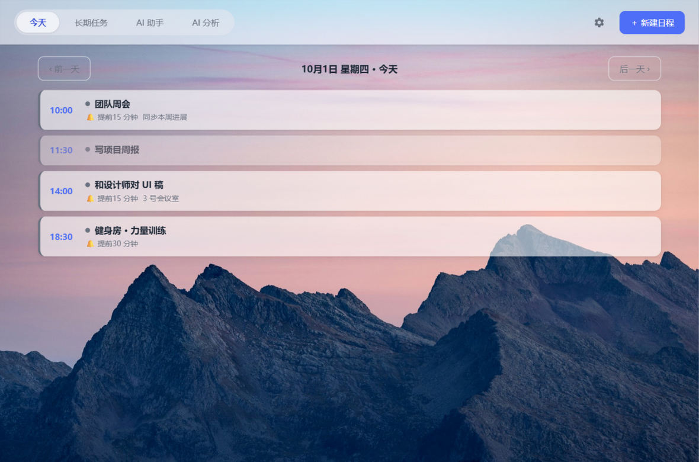
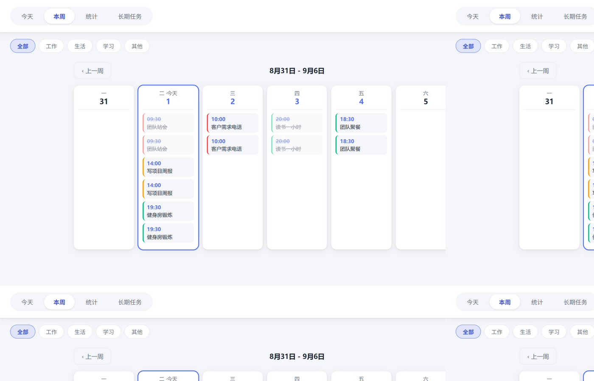
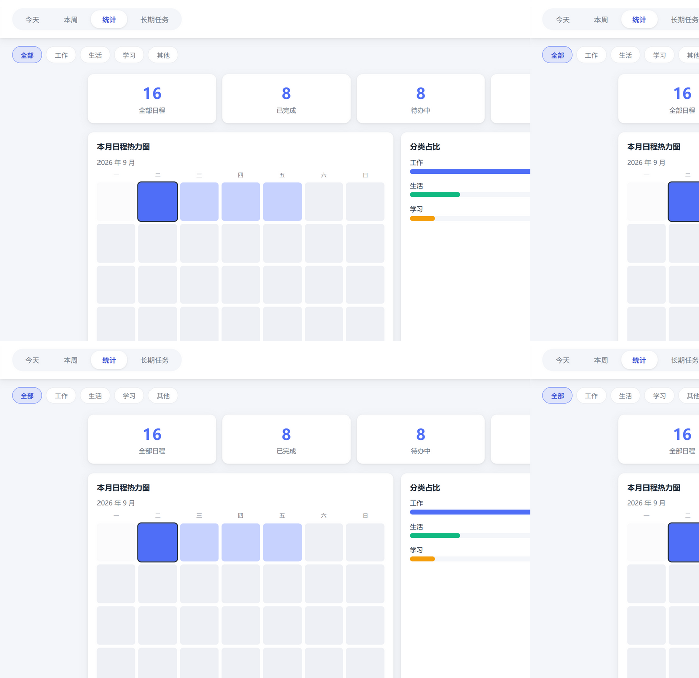
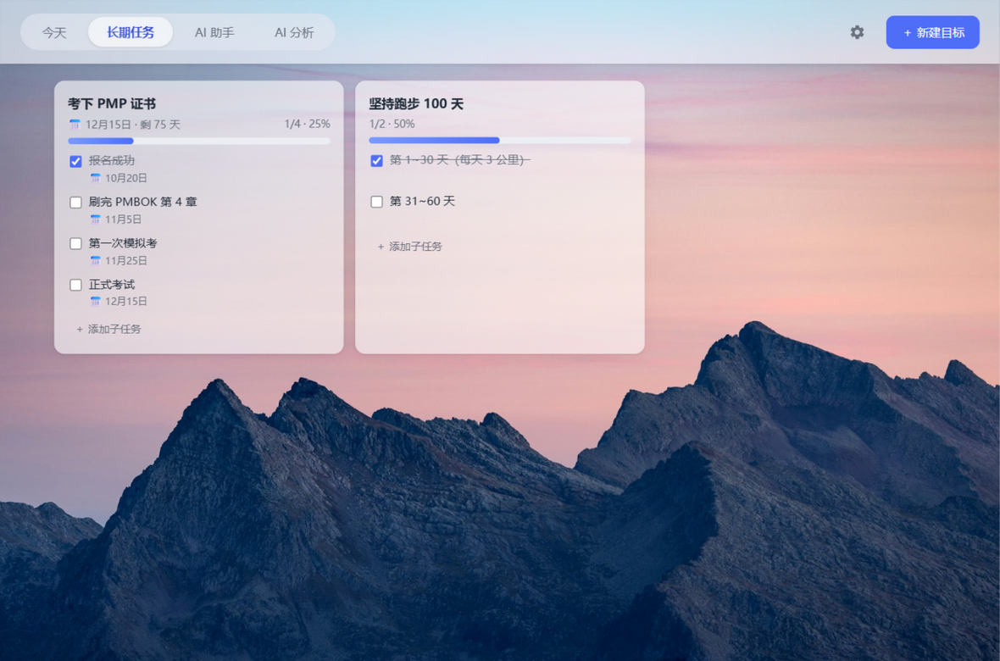

# 📅 Schedule Buddy

**English** | [简体中文](README.zh-CN.md)

A standalone, zero-config, **local-first scheduler**. Three forms, one experience: a **Windows desktop app** (standalone window, no browser), an **Android app** (a real installable APK), and a **mobile web app** (opens in any browser). Events, long-term goals and statistics are always stored on your own device — nothing is ever uploaded.

| Day view | Week view | Stats | Long-term goals |
| --- | --- | --- | --- |
|  |  |  |  |

## 📥 Download (pick your platform)

All packages live under **[GitHub Releases (go to the latest)](https://github.com/Weltspace/schedule-buddy/releases/latest)**:

| Platform | Download | How to use |
| --- | --- | --- |
| 🪟 Windows | `ScheduleBuddy-vX.X-windows-portable.zip` (~22 MB) | Extract → double-click `start_schedule_buddy.vbs`. **No install, no Python, no admin** |
| 🤖 Android | `ScheduleBuddy-vX.X.apk` (~2 MB) | Send it to your phone via WeChat → tap to install (upgrades keep your data) |
| 📱 Mobile web | nothing to download | Open the GitHub Pages URL in any browser (see "Mobile version") |

> Note: release downloads are currently reachable from mainland China networks without a VPN (tested). If a link won't open: try another browser or later, download on a PC and send the file to the phone via WeChat, or use any GitHub mirror/accelerator.

## ✨ Features

- **AI assistant**: plan in one sentence ("meeting at 3pm tomorrow", "30 minutes of vocabulary every morning for two weeks") — the AI parses times and creates/edits events and goals directly, with multi-turn follow-ups
- **AI insights**: nothing runs until you click "Analyze" (zero cost otherwise); get a completion chart, insights and suggestions, then keep asking follow-up questions
- **Desktop window**: runs as a standalone window (pywebview); clicking × minimizes to the system tray while reminders keep working; quit from the tray menu
- **Android app**: a real installable APK (~2 MB) — own launcher icon, fullscreen, fully offline, data in the app's private storage; export the sync file straight to WeChat via the share sheet, and open WeChat-received sync files directly in the app
- **Event management**: create / edit / delete / mark done, with a deliberately minimal interface (tag systems like priorities and categories were removed on purpose)
- **Reminders**: from 5 minutes to 1 day ahead, delivered as Windows toast notifications; reminders missed by more than 10 minutes are skipped instead of flooding you on startup
- **Long-term goals**: set goals with optional deadlines (shows "N days left", red when overdue) and per-step deadlines too; drag-and-drop to reorder both goals and steps; progress bars update automatically
- **Statistics & reports**: completion rate, monthly heatmap, category breakdown, plus a **weekly report** (browse any week, compare with the previous one) and an **overall report** (6-month trend, most productive day)
- **Custom background & icon**: drop an image in Settings — the app background and the icons in the title bar, taskbar, tray, desktop shortcut and Start Menu all update at once; one click to restore defaults
- **UI language**: switch 中文 / English from the ⚙ Settings menu (your event content stays as-is)
- **UI opacity**: with a background image set, card opacity is adjustable via a slider
- **Local data**: just a few files on your disk — copying them is a backup

## 🚀 Quick Start (beginner friendly, step by step)

> Requires: a Windows 10/11 PC. No command line needed except one optional step.
>
> **Easiest path**: download `windows-portable.zip` from [Releases](https://github.com/Weltspace/schedule-buddy/releases/latest), extract, and jump straight to "Step 4: Launch!".
>
> **First, check whether the folder contains a `runtime` folder:**
> - **It does** (a zip copied from a friend, or a release package): nothing to install — **jump straight to Step 3!**
> - **It doesn't** (a source download from GitHub): do Steps 1–2 to install Python and dependencies.

### Step 1: Install Python (skip Steps 1–2 if the folder already has `runtime`)

1. Open [https://www.python.org/downloads/](https://www.python.org/downloads/) and click the yellow **Download Python 3.x.x** button
2. Run the installer and **make sure to check "Add Python to PATH"** at the bottom of the first screen, then click **Install Now**
3. That's it

> ⚠️ Forgetting "Add Python to PATH" is the #1 beginner mistake. If you already installed without it, re-run the installer and choose Modify, or reinstall.

### Step 2: Download this app

1. On this page click the green **Code** button → **Download ZIP**
2. Right-click the downloaded `schedule-buddy-main.zip` → **Extract All** (don't run things from inside the ZIP!)
3. Put the extracted `schedule-buddy-main` folder wherever you like (e.g. `D:\`), and try not to move it afterwards

> Git users: `git clone https://github.com/Weltspace/schedule-buddy.git`

### Step 3: Install dependencies (double-click one file, once only; skip if `runtime` exists)

Open the extracted folder and **double-click `install_requirements.bat`**. Wait for "安装完成" (needs internet, about 1–3 minutes). This installs everything the app needs — you never have to do it again.

### Step 4: Launch!

**Double-click `start_schedule_buddy.vbs`** — the Schedule Buddy window pops up. Enjoy!

> If the folder has `runtime`, this is the whole setup: it ships with a complete bundled environment (Python plus all dependencies), so **no Python install and no administrator rights are needed**.

- The ⚙ gear in the top-right opens Settings (language / background / icon / opacity)
- Clicking × only hides the window to the tray; to **quit for real**, right-click the tray icon → 退出 (Exit)
- Want it to auto-start with Windows? Put a shortcut to `start_schedule_buddy.vbs` into the Startup folder (`Win+R`, type `shell:startup`, press Enter)

### Step 5 (recommended): create a desktop shortcut

Double-click `create_desktop_shortcut.py` — it creates a "日程助手" shortcut with the calendar icon on your desktop. (The app also auto-creates/repairs this shortcut on every start; on machines with `runtime` and no Python installed, just start the app once instead of running this.)

> 📌 From now on: double-click the desktop "日程助手" shortcut or `start_schedule_buddy.vbs`. If the app is already running, launching it again just brings the window back.

## 🖥️ Using the app

- **今天 / This Week**: plan and review events by day or week; hide completed items from the top bar
- **Stats**: completion rate, monthly heatmap, category breakdown
- **Weekly / Overall report**: scroll down in Stats — the weekly report browses any week (per-day progress, comparison with last week); the overall report aggregates everything (6-month trend, most productive weekday)
- **Long-term Goals**: the 4th tab. Type a goal (deadline optional) → Add; each step can have its own deadline via the inline "📅 截止日期" button; drag goal cards and steps to reorder; check steps to grow the progress bar

## 🎨 Background & icon (the fun part)

Click the ⚙ gear in the top-right to open Settings:

- **Background image**: drop an image onto the dashed area to apply it instantly; the opacity slider tunes how solid the cards are; "恢复默认背景" restores the default
- **App icon**: drop an image (256×256+ recommended, auto-cropped to square) — the icons in the **title bar, taskbar, tray, desktop shortcut and Start Menu** all become yours; "恢复默认图标" restores the default

You can also drag an image onto `change_icon.py` to change only the icon.

## 📱 Mobile version (Android app / web PWA, sync with your PC)

Three ways to run it on a phone; schedule data always lives on the device (AI calls GLM directly from the device).

### Option 1: Android app (recommended, most complete)

A real standalone APK — launcher icon, fullscreen, no browser UI, fully offline, and **data lives in the app's private storage** (not in a browser, so system cleanup can't touch it):

1. Grab the latest `ScheduleBuddy-vX.X.apk` from [Releases](https://github.com/Weltspace/schedule-buddy/releases), send it to your phone via WeChat/QQ, and tap to install (the "unknown apps" prompt is Android's normal warning for non-store installs — allow it)
2. Open the app and paste your Zhipu GLM API key in ⚙ Settings — that's the whole setup
3. Sync is native: tap "Export sync file" to get the **system share sheet** (pick WeChat → File Transfer); for a file received in WeChat, tap it → "…" → **Open with → Schedule Buddy** for a one-tap import, no need to leave WeChat

Build it yourself: run `./runtime/python.exe make_apk.py` on a PC (one-time JDK / Android SDK / Gradle setup — see the header of `make_apk.py`). After code changes just rebuild and install over the old APK — data survives the upgrade.

### Option 2: Web app (PWA, opens in any browser)

1. Publish to GitHub Pages from your PC: `python deploy_pages.py` (needs a git remote; alternatively upload `index.html`, `manifest.json`, `sw.js` and the `static/` folder manually on github.com)
2. Enable Pages in repo Settings (source: gh-pages branch), then open `https://<user>.github.io/<repo>/` on the phone
3. Paste your GLM API key in ⚙ Settings
4. To make it feel like an app: ⚙ Settings → **Install to Home Screen** (Chrome/Edge install it as a standalone app; if your browser shows no install dialog, use its menu "Add to Home screen" — most Chinese browsers only create a bookmark shortcut, so use Option 1 for a real app)

### Option 3: Access the PC over LAN

See "📶 Access the PC version from your phone" below.

**Keeping data in sync (manual sync file):** in ⚙ Settings → "Data Sync", **export** a sync file on one device, send it to the other (e.g. WeChat), and **import** it there (full overwrite, with a warning if the target has unsynced changes). On the Android app the export pops the share sheet and WeChat-received files can be opened directly by the app. Events and goals are synced; background/theme stay per-device.

## 📶 Access the PC version from your phone (optional, off by default)

The server listens on localhost only (safe default — there is no login). On a trusted home Wi-Fi:

1. Quit the app completely
2. In a command prompt (`Win+R`, type `cmd`):
   ```
   set SCHEDULE_BUDDY_LAN=1
   python app.py
   ```
3. On your phone, open `http://<your-pc-ip>:5217` (find the IP with `ipconfig`)

## 🤖 AI features (optional)

The AI assistant and AI insights are off by default: paste a [Zhipu BigModel](https://open.bigmodel.cn/) API key in ⚙ Settings to enable (`glm-4.7-flash` is the free default, with free backup `glm-4.5-flash` for rate-limited periods; `glm-5.3-flash` is stronger but billed — switch in Settings when you want deeper analysis. The key is stored only in `data/settings.json` on your machine and never uploaded).

- **AI assistant**: conversational planning — create several events at once, reschedule, query, add goals and steps
- **AI insights**: three lenses — **weekly / monthly / long-term** (heatmap, completion rate, progress bars, deadline alerts); data is aggregated locally first, one AI call happens only when you click "Analyze"; follow-up questions reuse that aggregate

Everything else works without any AI setup.

## 💾 Data & backup

Everything lives in the `data` folder: `schedule.json` (events & goals), `settings.json` (preferences). **Backup = copy the `data` folder**; restore = put it back. If a file gets corrupted the app won't crash (it renames the broken file and starts fresh), but back up regularly anyway.

## ❓ FAQ

**Does it need administrator rights?**
No. The app only reads/writes its own folder, the Desktop and the Start Menu (all inside your user profile); there is no elevation logic in the code. If the first launch shows the blue "Windows protected your PC" dialog, that's SmartScreen's routine warning for downloaded files — click "More info → Run anyway". It has nothing to do with administrator rights.

**A .bat / .py file flashes and disappears, or "python is not recognized"?**
Python isn't installed properly or "Add Python to PATH" was missed. Reinstall Python with the checkbox, then run `install_requirements.bat` again.

**Double-clicked the .vbs and nothing happened?**
Wait 2–3 seconds for the window. If you see the app in the taskbar but no window, click the taskbar button. If still nothing, run `start_schedule_buddy_console.bat` — the console window shows the actual error.

**"Port already in use"?**
The app is already running — launching it again just brings the window back. To change the port: `set SCHEDULE_BUDDY_PORT=8080` before `python app.py`.

**No toast notifications?**
Windows Settings → System → Notifications: make sure notifications for the app (python.exe) are enabled.

**How do I quit completely?**
Right-click the tray icon → 退出 (Exit). Closing the window only minimizes to the tray.

**Moved the folder to another PC / path and the shortcut broke?**
The folder is fully portable — data travels with it. Run `create_desktop_shortcut.py` once from the new location, or just start the app once: it repairs the desktop shortcut automatically.

**Antivirus complains?**
This is a plain Python script with no network uploads — safe to whitelist (some AV products are just sensitive to script-based launchers).

**The Android app warns "unknown apps / blocked install"?**
Android's normal prompt for installs outside app stores. Tap "Install anyway / allow" in the dialog, or grant the "install unknown apps" permission to WeChat / your file manager in system settings.

**Tapping "Export / Background image / Import" in the Android app does nothing?**
Update to APK v1.1 or newer (older builds lacked the native file chooser and share bridge). After exporting, a system share sheet appears — pick a target (e.g. WeChat) there to finish.

**How do I update the Android app?**
Install the new APK over the old one — data is kept (same signing key). The web version is always current on load; no action needed.

## ⚙️ Environment variables (optional)

| Variable | Default | Description |
| --- | --- | --- |
| `SCHEDULE_BUDDY_PORT` | `5217` | Server port |
| `SCHEDULE_BUDDY_LAN` | off | Set to `1` to listen on the LAN (see phone access) |
| `SCHEDULE_BUDDY_TIMEOUT` | `120` | Browser-fallback mode: auto-exit after all pages are closed for N seconds |

## 📁 Project structure

```
├── AGENTS.md                     # Project guide for AI coding assistants (architecture/conventions/pitfalls)
├── app.py                        # Main: Flask API, desktop window, tray, AUMID
├── ai.py                         # AI: GLM tool-calling assistant, insights
├── storage.py                    # Data layer: events/goals/settings/reports, atomic writes
├── media.py                      # Background saving, icon generation, taskbar icon (AUMID), shortcuts
├── notifier.py                   # Windows toast notifications
├── make_icon.py                  # Default icon generator (recolor & re-run to make it yours)
├── make_pwa_icons.py             # PWA PNG icons generated from icon.ico
├── change_icon.py                # Manual icon change: drop an image on it
├── create_desktop_shortcut.py    # Creates the desktop shortcut
├── deploy_pages.py               # Publishes the web app to GitHub Pages (gh-pages branch)
├── make_apk.py                   # One-command Android APK build (assets → Gradle → sign → dist/)
├── make_zip.py                   # One-command Windows portable zip (extract & run, for Releases)
├── android/                      # Android shell project: WebView offline shell + WeChat share/import bridge
├── dist/                         # Build output (ScheduleBuddy-vX.X.apk, not committed)
├── start_schedule_buddy.vbs      # Daily launch entry (no console; prefers runtime/)
├── start_schedule_buddy_console.bat  # Launch with console (for log/debug)
├── install_requirements.bat      # Dependency installer (when runtime/ is absent)
├── index.html                    # The single HTML of the whole UI (PC & mobile share it)
├── manifest.json + sw.js         # PWA: install-to-home-screen + offline cache (web version only)
├── runtime/                      # Bundled portable env: Python 3.12 + all dependencies
├── requirements.txt              # Dependency list (for pip install/upgrades)
├── static/api.js                 # Frontend data facade: Flask on PC / local impl on mobile
├── static/local/storage.js       # Mobile local data layer (IndexedDB, twin of storage.py)
├── static/local/ai.js            # Mobile local AI (browser → GLM directly, twin of ai.py)
├── static/main.js + style.css    # Frontend logic & styles (i18n dictionaries, mobile layout)
└── data/                         # Your data (schedule.json / settings.json)
```

## 📦 Sharing / open-source release

- **Zip and send**: just compress the whole folder into a zip — any Windows 10/11 recipient can extract it and double-click `start_schedule_buddy.vbs`, **no Python installation required** on their machine. The `windows-portable.zip` on Releases is exactly that — rebuild it yourself with `./runtime/python.exe make_zip.py`.
- **Attach APK to GitHub Releases**: `make_apk.py` outputs to `dist/` — upload `ScheduleBuddy-vX.X.apk` to a Release so Android users can install the app without any build tooling.
- **Git hosting**: `runtime/` is large (~50 MB of binaries) and should not be committed (excluded in `.gitignore`). People who clone the repo follow "Quick Start" to install Python once and double-click `install_requirements.bat`; alternatively attach a zip with `runtime/` included to your GitHub Releases.

## 🔧 Technical notes

- **Runtime**: pywebview desktop window (× hides to tray, stays resident); falls back to browser mode if pywebview is missing
- **Android shell**: an offline WebView shell with the whole frontend bundled in the APK, served through WebViewAssetLoader under a proper https origin (IndexedDB is unreliable on file://). A native bridge handles the file chooser (background/import), the system share sheet (export) and WeChat "Open with → Schedule Buddy" (one-tap import). The Service Worker is disabled inside the APK (the frontend ships in the package; an SW would serve stale files after upgrades)
- **Taskbar icon**: explicit AppUserModelID + a Start Menu shortcut carrying the same AUMID, so icon changes apply to the taskbar too
- **Reminders**: a background thread scans due events every 30 s and fires toasts; open pages show in-app toasts via polling; a shared "reminded" marker prevents duplicates; items overdue by 10+ minutes are skipped silently
- **Data safety**: every write is atomic (temp file + replace) with corruption recovery; all requests are CSRF-protected

## License

[MIT](LICENSE)
